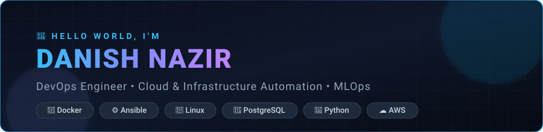

  

 

---

### 👨‍💻 About Me

I am a results-driven **DevOps Engineer** and **MLOps Trainee** based in Jammu & Kashmir, India. I specialize in architecting reliable containerized systems, automating cloud infrastructure, configuring Linux server environments, and building robust database backends.

- 🔭 **Currently Building**: Production-grade multi-container architectures, Infrastructure as Code with Ansible, and containerized LAPP stacks.
- 🎯 **Current Focus**: Advanced Docker workflows, persistent storage drivers, bridge & overlay networking, and CI/CD pipelines.
- 💡 **Core Strengths**: Linux System Administration, Containerization, Relational Database Engineering (PostgreSQL), and Automation Scripting (Python & Shell).
- 💬 **Ask me about**: Docker lifecycle & networking, Ansible automation playbooks, Linux troubleshooting, and PostgreSQL administration.
- 📫 **Contact**: [danishnazir20699@gmail.com](mailto:danishnazir20699@gmail.com)
- ⚡ **Engineering Motto**: *"Automate once, scale predictably, run reliably."*

---

### 🛠️ Tech Stack & Skills

#### **DevOps & Containerization**

  
  
  
  
  
  
  
  

#### **Databases & Web Servers**

  
  
  
  

#### **Programming & Automation**

  
  
  
  
  
  

---

### 🚀 Featured DevOps Repositories

| Repository | Focus & Architecture | Primary Tech |
| :--- | :--- | :--- |
| [**docker**](https://github.com/Danish20699/docker) | Production containerization labs covering container lifecycles, bind mounts, volume persistence, isolated custom networks, and multi-container stacks. | Docker, Postgres, Apache, Linux |
| [**-portfolio-ansible-automation**](https://github.com/Danish20699/-portfolio-ansible-automation) | Automated provisioning, deployment, and lifecycle management of a dynamic LAPP stack across Linux VMs using modern Ansible Playbooks and FQCN. | Ansible, YAML, Linux, PHP |
| [**linux**](https://github.com/Danish20699/linux) & [**linux1**](https://github.com/Danish20699/linux1) | Comprehensive Linux administration labs: user/group management, permissions, systemd services, SSH hardening, disk partitioning, and bash automation. | Linux, Bash, SysAdmin |
| [**postgresql-labs**](https://github.com/Danish20699/postgresql-labs) | Hands-on relational database labs covering DDL/DML, indexing strategies, user roles, security, backup/restore, and container volume persistence. | PostgreSQL, SQL, Database Design |
| [**python-AM**](https://github.com/Danish20699/python-AM) | Practical Python automation suites for DevOps operations, Google Sheets API synchronization, and infrastructure monitoring. | Python, REST APIs, Automation |
| [**php-labs**](https://github.com/Danish20699/php-labs) | Dynamic web application architecture, database connectivity using PDO/pgSQL drivers, and Apache web server integration. | PHP, PostgreSQL, Apache |

---

### 📊 GitHub Activity & Statistics

  

    
    
  

  

    
  

---

### 🌐 Connect With Me

